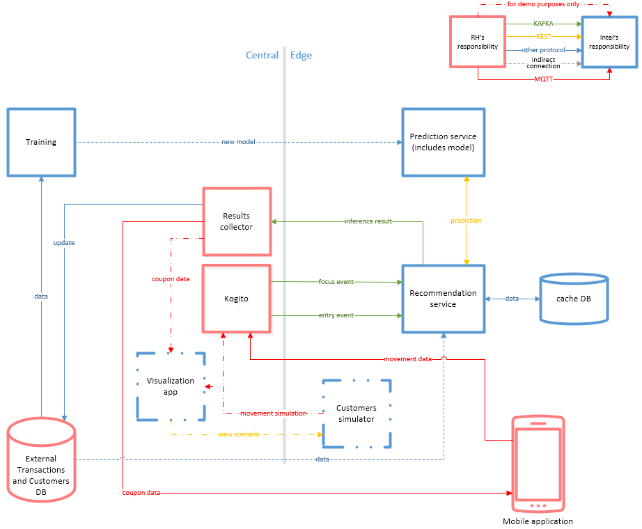

# Retail Store of the Future

**Disclaimer!** This solution was created for demo purposes only. It contains simplifications
and must not be used for production purposes!

This solution shows some potential use-cases and capabilities of RedHat and SAP components in
Intel-driven environments.

In the Retail Store of the Future, the customer is in the center of the action.
Thanks to the advanced technologies the store can "feel" customer's needs and help
her/him to make better purchasing decisions.

This solution uses AI techniques to increase customer satisfaction by proposing the most
interesting coupons while moving through the store. In the proposed scenario the system also detects
browsing customers and sends the assistant to the customer.

The "Retail Store of the Future" project shows a potential architecture and components that could
be used in a real-world scenario. Depending on the final solution and needs some elements
could be changed, added, or removed.

## Table of contents

* [Solution diagram and components description](#solution-diagram-and-components-description)
  * [Training](#training)
  * [Prediction Service](#prediction-service)
  * [Recommendation Service](#recommendation-service)
  * [Customers simulator](#customers-simulator)
  * [Visualization app](#visualization-app)
* [Development](#development)
* [Deployment and production](#deployment-and-production)

## Solution diagram and components description

### Training

The training part is made in the jupyter notebooks using Intel DAAL libraries.

All scripts and necessary components are available in
[training-with-artificial-data](./training-with-artificial-data) path.

There was a special data generator created for training purposes. It is placed in the
[artificial-data-generator](./artificial-data-generator) path.

### Prediction Service

Prediction service handles the model.

It provides a REST API that can be called to retrieve predictions for coupons.

Check [Prediction Service](./prediction-service) path for details.

### Recommendation Service

Recommendation service provides MQTT interfaces for the recommendation process.

It observes MQTT topics, pulls data, creates the context, and sends it to the Prediction Service.

The response is interpreted, processed, and sent to the suitable MQTT topic.

### Customers simulator

This simulator was made for demo purposes. It can simulate customers' movement through the store.
See more details in the [README file](scenario-player/README.md).

### Visualization app

This application provides the interface for the store's crew. However, for demo purposes, it was also
extended to simulate customer's mobile app. [More details](visualization-app).

Visualization app contains:

* Store interface (customers preview, alerts)
* Simulator interface (you can create a new scenario for customers simulator using UI)
* Mobile app simulation (shows customer's mobile app behavior while moving through the store)

## Development

Each component has its own instructions describing the development, deployment, structure, interfaces, and more.
Please find the particular component README for details.

As shown in the diagram, there are additional, external components used in this solution. You can set up
your own development environment using containers. The development instruction can be found [here](DEVELOPMENT.md).

## Deployment and production

The solution is adapted to run in an OpenShift environment. The deployment process is described in [infra](./infra) path.
