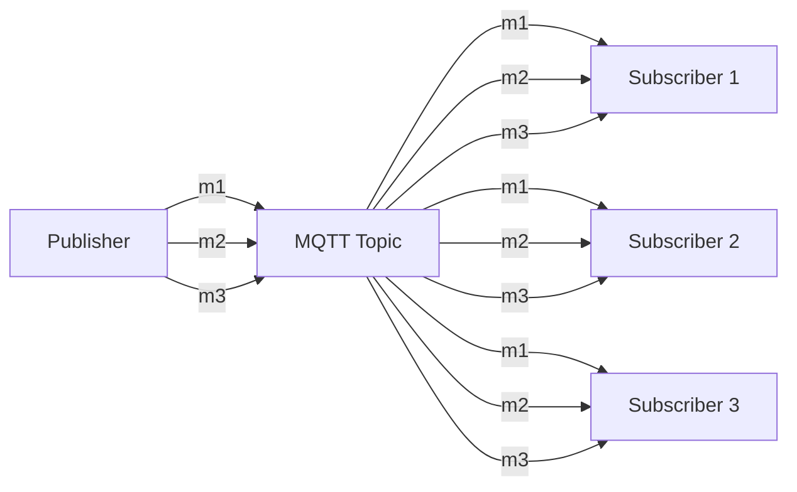
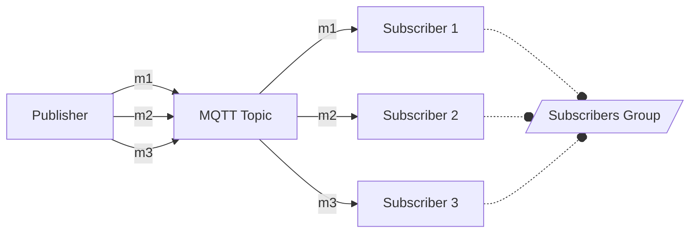

# Client load balancing


With support of shared subscriptions, client Load Balancing is now included in MQTT. 

In the previous version of MQTT (v3.1, v3.1.1), the message load of a single topic was distributed amongst all subscribers. In other words: every subscriber received every message.

With MQTT v5, the message load of a single topic can be distributed amongst a group of subscribers. In other words: any message published to a topic is received by only one subscriber in the group. It allows to easily scale the number of subscribers.


## AMQ Broker configuration
Support for [MQTT v5 was added in ActiveMQ Artemis 2.21.0](https://activemq.apache.org/components/artemis/download/release-notes-2.21.0).
Make sure that you are using AMQ Broker 7.10.0 (or later) [which contains Artemis 2.21.0](https://access.redhat.com/articles/3188232#:~:text=AMQ%207.10,ActiveMQ%20Artemis%202.21.0).

Othen that configuring an MQTT acceptor (as you would normaly do), you do not need to change anything in the broker configuration.

## Shared subscription mechanics

The "standard" delivery flow is as follows:

Every message published to the topic is received by all subscribers.

With shared subscriptions, the delivery flow is as follows:



Shared subscriptions use the following topic structure:

    `$share`/`GROUPID`/`TOPIC`

Where:
- `$share` is a constant which indicates, tha given subscriber wants to use shared subscription mechanism
- `GROUPID` is an identifier of a group 
- `TOPIC` is the acutal topic subscription

For example, the following are valid shared subscription topic designators:
- $share/group1/test
- $share/group2/test
- $share/some-group/servers/+/power

      Please, mind that the producer uses only the `TOPIC` part as a topic name for publishing messages.


## Python example

In this example, we are going to use the following python code to simulate a publisher and multiple subscribers.

### Publisher

```python
import os
import paho.mqtt.client as mqtt
import time

SLEEP_TIME=1
host = os.environ.get('HTTP_HOST', 'localhost')
port = int(os.environ.get('HTTP_PORT', 1883))


def on_publish(client, userdata, result):
    print("Published")

client = mqtt.Client()
client.on_publish = on_publish
client.connect(host, port)
client.loop_start()


i = 0
while True:
    client.publish("test", f"Message {i}")
    i += 1
    time.sleep(SLEEP_TIME)

```

### Subcriber

```python
import os
import paho.mqtt.client as mqtt
import time

host = os.environ.get('HTTP_HOST', 'localhost')
port = int(os.environ.get('HTTP_PORT', 1883))
pid = os.getpid()

def on_connect(client, userdata, flags, rc):
    print("Connected with result code: " + str(rc))
    client.subscribe("$share/Group1/test")

def on_message(client, userdata, msg):
    print(f"[{pid}] Received: {msg.payload.decode()}")

client = mqtt.Client()
client.on_connect = on_connect
client.on_message = on_message
client.connect(host, port)
client.loop_forever()

```

### Running the example

Run the publisher:
```bash
python3 publisher.py
```

Run the subscriber, couple of times:
```bash
client-load-balancing$ python3 subscriber.py &
[1] 11567
client-load-balancing$ Connected with result code: 0
python3 subscriber.py &
[2] 11570
client-load-balancing$ Connected with result code: 0
[11567] Received: Message 0
[11570] Received: Message 1
[11567] Received: Message 2
[11570] Received: Message 3
[11567] Received: Message 4
[11570] Received: Message 5
[11567] Received: Message 6
[11570] Received: Message 7
[11567] Received: Message 8
[11570] Received: Message 9
[11567] Received: Message 10
[11570] Received: Message 11
[11567] Received: Message 12
[11570] Received: Message 13
[11567] Received: Message 14
[11570] Received: Message 15
```

As you can see, the `Message 0` is recieved by only one subscriber (the first one), `Message 1` by the second one, and so on.

### More information

For more information about MQTT v5, see the official specification at <https://docs.oasishttps://www.emqx.com/en/blog/introduction-to-mqtt5-protocol-shared-subscription>
