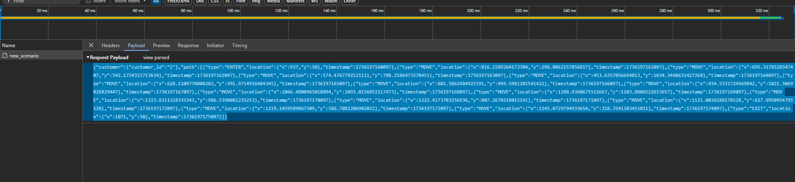

# Scenario Player Component

This component is responsible for playing demo scenarios discovered in a `scenario` path.

It sends direct MQTT messages with pre-recorded demo scenarios.

It can be used for demo purposes.

No other components besides the MQTT broker and the UI are required to run it; however, it is
highly recommended to run the scenario-player as well.

## How to Run Scenarios

There are 3 examples in the `scenarios` path already included, however, you can create your
own scenarios. Check the documentation below for more details on how to do it.

### Prerequirements:

* MQTT Brocker is running and allows anonymous connections
* install requirements (`pip3 install requirements.txt`)

### Running scenario

To run the scenarios, execute the following command:
```bash
python3 main.py
```

### Configurations

This component can be configured via the following environment variables defined in the `config.py` file:

* `MQTT_HOST`: Defines the URL of the MQTT broker.
* `MQTT_PORT`: Sets the port on which the MQTT broker is running.
* `CUSTOMER_ENTER_TOPIC`: Topic for events when a customer enters the store.
* `CUSTOMER_EXIT_TOPIC`: Topic for events when a customer exits the store.
* `CUSTOMER_MOVE_TOPIC`: Topic for events when a customer moves within the store.
* `CUSTOMER_BROWSING_TOPIC`: Topic for events when a customer is browsing products in the store.
* `COUPON_PREDICTION_TOPIC`: Topic for events related to predicting coupons for customers based on their behavior.
* `SCENARIOS_PATH`: Defines the path where the scenarios are stored. Defaults to `scenarios`.

All variables has default values, so ensure to set them appropriately before running the component to
achieve the desired configuration.

## How to Convert Scenarios

This scenario converter allows you to convert scenarios generated in the UI to the format of a demo-scenario-player.

1. Use the "Create customer scenario" option in the UI.
2. Generate the scenario.
3. Open the browser's developer tools to capture the HTTP request from the UI to the scenario-player.
4. Send your scenario by clicking the `Start simulation` button.
5. Copy the body of this request.
6. Set the `SCENARIO` environment variable to the value of the body (as a string).



To convert scenario, use the `scenario_converter.py` file:
```bash
python3 scenario_converter.py
```

### Configurations

* `SCENARIO`: REQUIRED; scenario as a string
* `STEP_LENGTH`: Sets the length of each step in the scenario in seconds. Defaults to 1.
* `STEPS_DELAY`: The total number of steps to skip from the beginning of the simulation. Defaults to 0.
