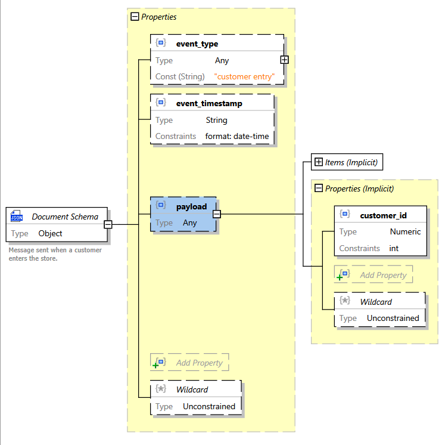
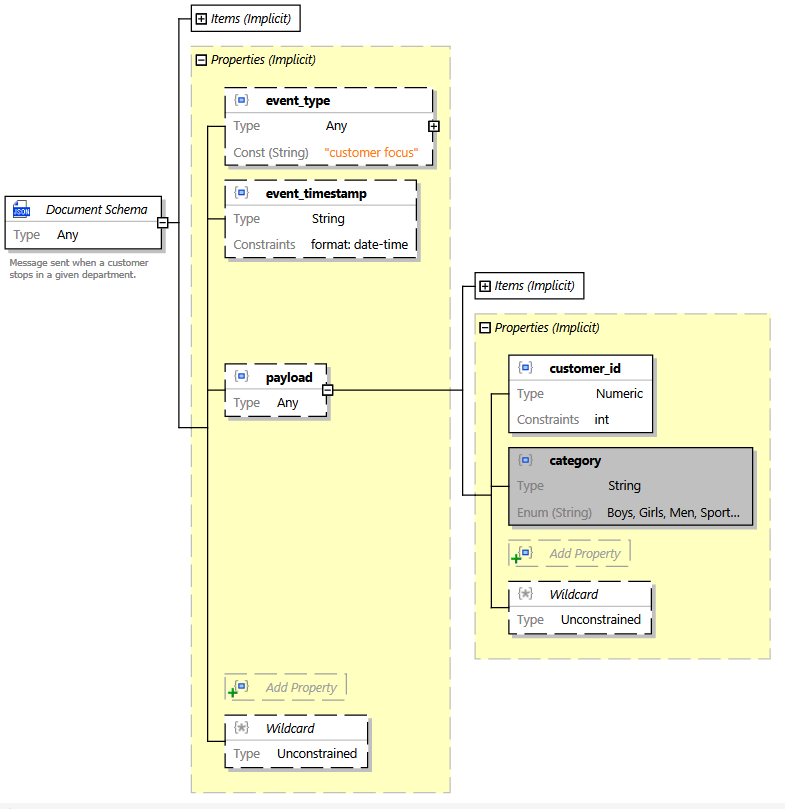
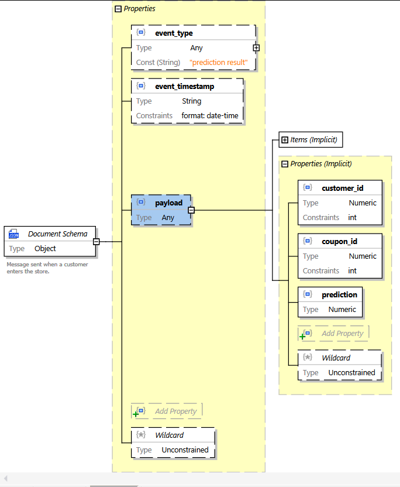

# Functionality 
This service creates Kafka consumers to listen to "entry event" and "focus event".

**Entry event** is generated (externally), whenever a customer enters the store.

**Focus event** is generated (externally), whenever the platform detects, that a customer has stopped in a given
department (he is probably interested in buying some goods from that department).

This service's responsibility is to:

* fetch customer context (purchase history, demographics, etc.) from "the central" (datacenter), when the service
  receives *entry event*
* invoke/call prediction service to decide if the customer is willing to use promotion coupons from given department,
  when the service receives *focus event* and send prediction result to a dedicated Kafka topic.

## Table of contents

* [Functionality](#functionality)
  * [Event payloads](#event-payloads)
    * [Entry Event](#entry-event)
    * [Focus Event](#focus-event)
    * [Prediction Results Message](#prediction-results-message)
  * [Prediction request](#prediction-request)
* [Development](#development)
  * [Dependencies](#dependencies)
  * [Service configuration](#service-configuration)
  * [Running the service](#running-the-service)
  * [Testing with Kafka in docker-compose](#testing-with-kafka-in-docker-compose)
  * [Testing without Kafka](#testing-without-kafka)
  * [Docker image](#docker-image)
  * [Mock event endpoints](#mock-event-endpoints)
  * [Cache - DB](#cache---db)

## Event payloads

The service assumes the following data will be provided with given event types.

### Entry Event
The schema for entry event payload is


(See: [customer_entry.schema.json](schema/customer_entry.schema.json))

In this case, the example message looks like this:
```json
{
    "event_type": "customer entry",
    "event_timestamp": "2001-12-17T09:30:47.0",
    "payload": {
        "customer_id": 1
    }
}
```

### Focus Event
The schema for focus event payload is:


(See: [customer_focus.schema.json](schema/customer_focus.schema.json))

In this case, the example message looks like this:

```json
{
    "event_type": "customer focus",
    "event_timestamp": "2001-12-17T09:30:47.0",
    "payload": {
        "customer_id": 1,
        "category": "Boys"
    }
}
```

ATTOW, supported categories are 'Boys', 'Girls', 'Men', 'Sports', 'Women'.

### Prediction Results Message
The schema for prediction result message is:


(See: [prediction_result.schema.json](schema/prediction_result.schema.json))

In this case, the example message looks like this:

{
    "event_type": "prediction result",
    "event_timestamp": "2001-12-17T09:30:47.0",
    "payload": {
        "customer_id": 1,
        "coupon_id": 1,
        "prediction": 0.9
    }
}
## Prediction request 
In order to do the actual prediction, a REST call is made.

**TBD**
(See: [prediction.schema.json](schema/prediction.schema.json))


# Development

## Dependencies

Dependencies of the project are contained in [requirements.txt](requirements.txt) file. All the packages are publicly
available.

All the packages can be installed with:
`pip install -f requirements.txt`

## Service configuration

The service reads the following **environment variables**:

| Variable               | Description                             |  Default      |
|------------------------|-----------------------------------------|--------------:|
| BOOTSTRAP_SERVERS      | comma-separated list of Kafka brokers   | 127.0.0.1:9092|
| CLIENT_ID              | optional identifier of a Kafka consumer | kafkaClients  |
| GROUP_ID               | consumer group name 					   | None 		   |
| POLL_TIMEOUT           | time spent waiting for messages in in poll (ms) |   100 |
| AUTO_OFFSET_RESET      | see: auto.offset.reset setting in Kafka | 	  latest   |
| ENTRY_EVENT_TOPIC_NAME | topic for entry events              	   |    		 - |
| FOCUS_EVENT_TOPIC_NAME | topic for focus events              	   |    		 - |
| COUPON_PREDICTION_TOPIC_NAME | topic for sending prediction results |   		 - |
| COUPON_SCORER_URL      | URL of the scorer service               |   			 - |

(Parameters with `-` in "Default" column are required.)

Use [log_config.py](./app/utils/log_config.py) to **configure logging behaviour**. 
By default, console and file handlers are used. The file appender writes to `messages.log`.


## Running the service

For my development I created a project with dedicated virtual environment (Python 3.8, all the dependencies installed
there).

The code reads sensitive information (tokens, secrets) from environment variables. They need to be set accordingly in
advance.
`environment.variables.sh` can be used for that purpose. Then, in order to run the service the following commands can be
used:

```
$ . .environment.variables.sh
$ . venv/bin/activate
(venv)$ uvicorn app.main:app --host 0.0.0.0 --reload --reload-dir app
```
> Please, note `reload-dir` switch. Without it the reloader goes into an infinite loop because it detects log file changes (messages.log).

## Testing with Kafka in docker-compose

In my case, the quickest way to set up Kafka cluster for development purposes was to use Docker containers.

The procedure to **set up the cluster** boils down to:

```
curl --silent --output docker-compose.yml \
  https://raw.githubusercontent.com/confluentinc/cp-all-in-one/6.1.0-post/cp-all-in-one/docker-compose.yml

docker-compose up -d
```

See https://docs.confluent.io/platform/current/quickstart/ce-docker-quickstart.html for the details.

To **create a topic**:

```
docker-compose exec broker kafka-topics --create --bootstrap-server localhost:9092 --replication-factor 1 --partitions 1 --topic ENTRY_EVENT
```

where

* `broker` is the name of the container hosting Kafka broker instance
* `localhost:9092` is the broker's URL
* `ENTRY_EVENT` is the topic name

To **produce some testing messages**, one can issue the following command:

```
docker-compose exec broker \
  bash -c "seq 10 | kafka-console-producer --request-required-acks 1 --broker-list localhost:9092 --topic ENTRY_EVENT && echo 'Produced 10 messages.'"
```
or   
``` 
docker-compose exec broker \
  bash -c "echo '{\"event_type\":\"customer focus\",\"event_timestamp\":\"2001-12-17T09:30:47.0\",\"payload\":{\"customer_id\":3,\"category\":\"Boys\"}}' | kafka-console-producer --request-required-acks 1 --broker-list localhost:9092 --topic FOCUS_EVENTS && echo 'Message produced.'"
```

where

* `broker` is the name of the container hosting Kafka broker instance
* `ENTRY_EVENT` is the topic name
* `localhost:9092` is the broker's URL

## Testing without Kafka
For testing purposes, there are two endpoints that simulate events ("entry event", "focus event"),
as if they would appear on a dedicated Kafka topic.

In order for the service not to create real Kafka consumers and producers,
set `TESTING_NO_KAFKA` environment variable to "true".

This way, event processing logic can be tested without Kafka, for example:
```bash
curl -X 'POST' \
  'http://127.0.0.1:8000/mock_entry' \
  -H 'accept: application/json' \
  -H 'Content-Type: application/json' \
  -d '{
  "event_type": "entry event",
  "event_timestamp": "2021-03-18T08:29:02.160Z",
  "payload": {
    "customer_id": 3
  }
}'
```

or:

```bash
curl -X 'POST' \
  'http://127.0.0.1:8000/mock_focus' \
  -H 'accept: application/json' \
  -H 'Content-Type: application/json' \
  -d '{
  "event_type": "focus event",
  "event_timestamp": "2021-03-18T08:29:02.160Z",
  "payload": {
    "customer_id": 7,
    "category": "Sport"
  }
}'
```

## Docker image
The docker image for the service is [Dockerfile](Dockerfile).
It is based on FastAPI "official" image. 
See https://github.com/tiangolo/uvicorn-gunicorn-fastapi-docker 
for detail on configuring the container (http port, log level, etc.)

In order to build the image use:
```
docker build -t recommendation-service:0.0.1 .
```

> Set image name (`recommendation-service`) and tag (`0.0.1`) according to
> your needs.

To run the service as a Docker container run:
```
docker run -d -e LOG_LEVEL="warning"  --name recommendaition-service recommendation-service:0.0.1

```

## Mock event endpoints
For testing purposes, there are two endpoints that simulate events ("entry event", "focus event"),
as if they would appear on dedicated Kafka topic.

This way, event processing logic can be tested without Kafka, for example:
```bash
curl -X 'POST' \
  'http://127.0.0.1:8000/mock_entry' \
  -H 'accept: application/json' \
  -H 'Content-Type: application/json' \
  -d '{
  "event_type": "entry event",
  "event_timestamp": "2021-03-18T08:29:02.160Z",
  "payload": {
    "customer_id": 3
  }
}'
```
or:
```
curl -X 'POST' \
  'http://127.0.0.1:8000/mock_focus' \
  -H 'accept: application/json' \
  -H 'Content-Type: application/json' \
  -d '{
  "event_type": "focus event",
  "event_timestamp": "2021-03-18T08:29:02.160Z",
  "payload": {
    "customer_id": 8,
    "category": "Women" 
  }
}'
```

## Cache - DB

This component uses PostgreSQL as a cache. It stores coupons and customer data.

DB tables:

```sql
CREATE TABLE coupon_categories (
  id SERIAL,
  coupon_id INT,
  item_id INT,
  category VARCHAR(50),
  PRIMARY KEY (id)
);

CREATE TABLE coupon_info (
  coupon_id INT,
  mean_coupon_discount FLOAT,
  mean_item_price FLOAT,
  PRIMARY KEY (coupon_id)
);

CREATE TABLE customer_info (
  customer_id INT,
  age_range VARCHAR(6),
  marital_status VARCHAR(10),
  family_size INT,
  no_of_children INT,
  income_bracket INT,
  gender VARCHAR(1),
  mean_discount_used_by_cust FLOAT,
  unique_items_bought_by_cust INT,
  mean_selling_price_paid_by_cust FLOAT,
  mean_quantity_bought_by_cust FLOAT,
  total_discount_used_by_cust FLOAT,
  total_coupons_used_by_cust INT,
  total_price_paid_by_cust FLOAT,
  total_quantity_bought_by_cust INT,
  PRIMARY KEY (customer_id)
);
```

How to fill DB with data:

```sql
COPY coupon_categories(coupon_id, item_id, category) FROM '<<DATA_PATH>>/coupon_categories.csv' DELIMITER ',' CSV HEADER;
COPY coupon_info FROM '<<DATA_PATH>>/coupon_info.csv' DELIMITER ',' CSV HEADER;
COPY customer_info FROM '<<DATA_PATH>>/customer_info.csv' DELIMITER ',' CSV HEADER;
```

CSV files are available in the [../data-mining/coupon-based/csv_4_db/](../data-mining/coupon-based/csv_4_db/) path
