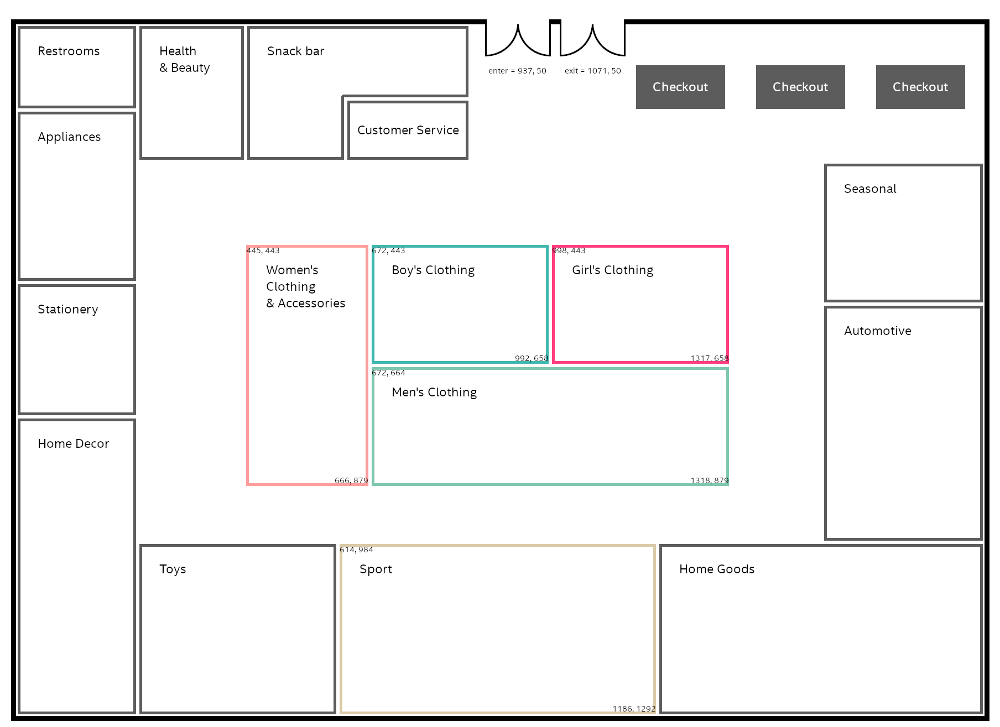

# Project description
This project was a part of broader demo. That broader demo analyzed customers movement in a retail store, determined their behaviour (for example: "customer stopped in men's clothes department") and use Machine Learning to model for purchase/product recommendation. The customer location was determined by movement sensors placed in the store.

This service customer behaviour in a retail shop:

* customer entering the store
* customer movement
* customer exiting the store
* by generating proper MQTT messages.

In this case, we are using a big store as an example, however, for the demo purposes, we predict customers' behaviors only in 5 areas: Women's, Men's, Boy's, Girl's, and Sport.

# Functionality

This application visualize the store and customers movement in it. The app also allows creating new scenarios and sending them to the scenario-player.

This is the UI for the demo described above.

This application uses a plan which is 1808px wide and 1315px high. In the plan below there are main areas borders (limit points) described.
There are also the entrance and exit points shown.



## Table of contents

* [Functionality](#functionality)
  * [Table of contents](#table-of-contents)
* [Usage](#usage)
  * [Dependencies](#dependencies)
  * [Service configuration](#service-configuration)
  * [Running the service](#running-the-service)
    * [Development](#development)
    * [Production](#production)
  * [App interfaces](#app-interfaces)
  * [Using the UI](#using-the-ui)

# Usage

This is a web service (implemented with FastAPI). By default, it works on port 8000. (See instructions for details on configuring and running the service.)

When starting, it does the following:

* connects to MQTT server
* exposes http endpoints with the UI
* exposes REST API (HTTP + WS) for the UI
* waits for, registers, and pass to the UI users movement

## Dependencies

Dependencies of the project are contained in requirements.txt file. All the packages are publicly available.

All the packages can be installed with: pip install -f requirements.txt

This application assumes running MQTT broker.

## Service configuration

The service reads the following **environment variables**:

| Variable                          | Description                                                                                      |                   Default |
|-----------------------------------|--------------------------------------------------------------------------------------------------|--------------------------:|
| MQTT_HOST                         |                                                                                                  |                         - |
| MQTT_PORT                         |                                                                                                  |                      1883 |
| MQTT_NAME                         |                                                                                                  |             demoVisClient |
| MQTT_PASSWORD                     |                                                                                                  |                           |
| ENTER_TOPIC                       |                                                                                                  |            customer/enter |
| MOVE_TOPIC                        |                                                                                                  |             customer/move |
| EXIT_TOPIC                        |                                                                                                  |             customer/exit |
| BROWSING_TOPIC                    |                                                                                                  |         customer/browsing |
| COUPON_PREDICTION_TOPIC           |                                                                                                  |       customer/prediction |
| SCENARIO_PLAYER_SCENARIO_ENDPOINT | full address (ex: `http://localhost:8004/scenario`) to the scenario-player's `scenario` endpoint |                         - |

(Parameters with `-` in "Default" column are required.)

Use [log_config.py](./app/utils/log_config.py) to **configure logging behaviour**. 
By default, console and file handlers are used. The file appender writes to `messages.log`.

## Running the service

### Development

`.environment.variables.sh` can be used for that purpose. Then, in order to run the service the following commands can be
used:

```shell
$ . .environment.variables.sh
$ . venv/bin/activate
(venv)$ uvicorn app.main:app --host 0.0.0.0 --reload --reload-dir app
```

> Please, note `reload-dir` switch. Without it the reloader goes into an infinite loop because it detects log file changes (messages.log).

### Production

The service is made to be run in an OpenShift environment. The deployment process is described in (infra)[../infra] path.

## App interfaces

| Endpoint/topic/address | Type       | Description                           |
|------------------------|------------|---------------------------------------|
| `/`                    | Web (HTTP) | The main UI page                      |
| `/phone/{customer_id}` | Web (HTTP) | Customer's phone simulation           |
| `/health`              | HTTP       | Service Health                        |
| `/api/new_scenario`    | HTTP       | Proxy to the scenario-player          |
| `/api/customers`       | HTTP       | Returns list of a few customers for demo purposes |
| `/ws/movement`         | Websocket  | Passes customers movements thru when received from MQTT topic |
| `/ws/coupons`          | Websocket  | Passes coupons info thru when recieved from MQTT topic |
| {CUSTOMER_ENTER_TOPIC} | MQTT       | Recieves `enter` events from Phone App or scenario-player |
| {CUSTOMER_EXIT_TOPIC}  | MQTT       | Recieves `exit` events from Phone App or scenario-player |
| {CUSTOMER_MOVE_TOPIC}  | MQTT       | Recieves `move` events from Phone App or scenario-player |

## Using the UI

When service is up and running go to the main path of it to see the UI, for example: `http://localhost:8000`

There are 2 main tabs - "Store preview" and "Create customer scenario".

1st one allows observing customers' movements in the store. On the right-hand side you can switch between the "Mobile app" and "Events log" view.
"Mobile app" lets you choosing the customer to observe. After choosing one its color on the plan changes. You can also see the simulation of
the client's phone application. "Events log" allows following the messages sent to the application via MQTT and then passed to the UI via Websockets.

2nd tab - "Create customer scenario" allows creating a new scenario for the selected customer. Select the user, then the pin type, and put some
pins on the plan. "Movement" pin lets you create points where the customer occurs for a short while. "Focus" points will generate multiple "Movement"
points to simulate the client's focus on the product. Next, select Customer step time (how long does it take to move between "movement" points).
Now start the simulation.


## To do
* describe the usage of certificates (MQTT_BROKER_CERT_FILE)
* explain usage of the CUSTOMERS_LIST_FILE, COUPONS_LIST_FILE parameters (or remove them)
* add BROWSING_TOPIC, COUPON_PREDICTION_TOPIC to "App interfaces" section (and explain its usage)
* add env variables descriptions in "Service configuration" section
* update "Production" section to be more specific 
  (possibly, remove OpenShift references as the service can be run in any environment)